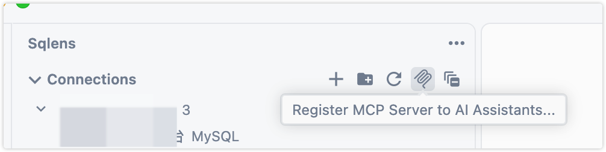
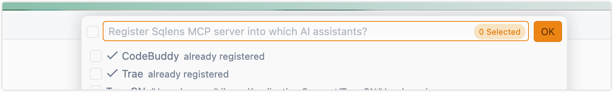
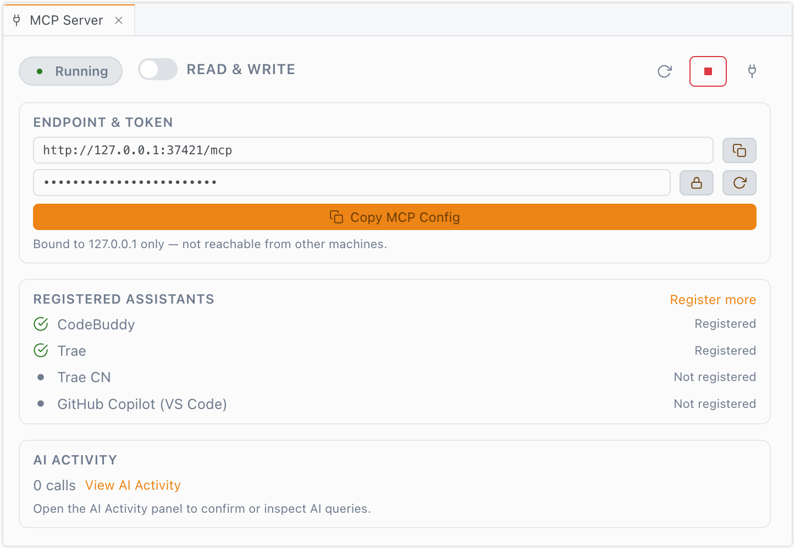

# Sqlens — Database Client & MCP for VS Code

[English](./README.en.md) | [简体中文](./README.md)

Sqlens is a free, open-source VS Code extension for browsing databases, running SQL, editing table data, and working with local SQLite files — with a built-in MCP server so AI assistants (CodeBuddy, Trae, GitHub Copilot, ...) can query your databases too.

It works in VS Code and VS Code forks such as Trae, and the UI follows your editor's display language (English / 简体中文).

## Features

- Manage database connections from the Sqlens activity bar.
- Connect to MySQL / MariaDB, PostgreSQL, and SQLite databases.
- Connect to ClickHouse (columnar, HTTP 8123), Elasticsearch (REST request editor), MongoDB (mongosh-style commands), and SQL Server (T-SQL) databases.
- Connect to Redis (standalone / cluster / sentinel, with SSH tunneling and TLS).
- Open `.db`, `.sqlite`, and `.sqlite3` files with the built-in SQLite viewer.
- Export/import connection configurations as JSON (passwords excluded by default; plaintext requires a confirmation) for moving between machines.
- Double-click a disconnected connection in the sidebar to connect (a single click only selects).
- Browse schemas, tables, views, columns, indexes, and foreign keys.
- Open table data in an editable data grid (sort, filter, paginate, inline edit).
- Run SQL from `.sql` files with CodeLens actions and per-file connection context.
- Copy rows or pages as CSV, TSV, JSON, XML, SQL `INSERT` / `UPDATE`.
- Embedded Quick View sidebar for row details and long values.
- Visual table creation and structure editing with generated SQL batches.
- Create databases, edit MySQL/MariaDB charset/collation, dump and import databases.
- Export/import table data, ER diagrams, and query execution plans.
- Project-level connections in `.sqlens.json`, SSH tunneling, `.env` auto-detection.
- Connections are shared across all VS Code forks on the machine (optional).
- Localized UI: English and Simplified Chinese, following the editor language.

## Supported Databases

| Database | Status |
| --- | --- |
| MySQL / MariaDB-compatible | Supported |
| PostgreSQL | Supported |
| SQLite | Supported via `sql.js` |
| Redis | Supported (standalone / cluster / sentinel, ioredis) |
| ClickHouse | Supported (`@clickhouse/client`; rich types, opt-in mutation editing, `FORMAT` export) |
| Elasticsearch | Supported (8.x; index/field tree, REST request editor, NDJSON export/import, aggregation bars) |
| MongoDB | Supported (official driver; mongosh-style queries, document CRUD, JSON export/import, `_id` cursor deep paging) |
| SQL Server | Supported (T-SQL; `OFFSET/FETCH` paging, multi-result-set tabs, `bcp` export, NTLM/Azure AD auth) |

## Getting Started

1. Install from the [Visual Studio Marketplace](https://marketplace.visualstudio.com/items?itemName=wwenc6621.sqlens-vscode).
2. Open the Sqlens view in the activity bar.
3. Click **New Connection**, pick a database type, fill in the details.
4. Click **Test**, then **Save** and **Connect**.

```bash
code --install-extension wwenc6621.sqlens-vscode
```

Manual VSIX installation: see [INSTALL_VSIX.md](./INSTALL_VSIX.md).

## MCP Server (for AI assistants)

Sqlens ships a local MCP (Model Context Protocol) server. Once started, AI assistants such as CodeBuddy, Trae, Trae CN, and GitHub Copilot can list tables, run read-only queries, and (optionally) write data through your saved connections.

### 1. Enable the server

The server starts automatically when the extension activates (default). Related settings:

| Setting | Default | Description |
| --- | --- | --- |
| `sqlens.mcp.enabled` | `true` | Start the local MCP server |
| `sqlens.mcp.port` | `37421` | Server port (`0` = auto); falls back to nearby ports if occupied |
| `sqlens.mcp.readOnly` | `true` | Only allow read statements (`SELECT/SHOW/DESCRIBE/EXPLAIN`, Redis `GET/HGETALL/SCAN/TYPE/...`) |
| `sqlens.mcp.writeMode` | `confirm` | Write handling: `confirm` / `allow` / `deny` |
| `sqlens.mcp.maxRows` | `100` | Max rows returned per query |
| `sqlens.mcp.maskSensitiveColumns` | `true` | Mask password/token-like columns in results |
| `sqlens.mcp.activityRetention` | `200` | AI activity entries to keep |

### 2. Register into your AI assistant

Click **Register MCP Server to AI Assistants...** in the view title bar (or run the same command from the palette):



Pick one or more assistants in the QuickPick — already-registered ones are checked:



The **MCP Server panel** in the sidebar shows the running status, endpoint and token, access mode (read-only / read-write), registered assistants at a glance, and can copy the full MCP config JSON in one click:



Sqlens writes its entry into their MCP config files without touching other entries:

| Assistant | Config file |
| --- | --- |
| CodeBuddy | `~/.codebuddy/mcp.json` |
| Trae | `~/.marscode/vscode.mcp.config.json`, `~/.trae/mcp.json`, ... |
| Trae CN | `~/Library/Application Support/Trae CN/User/mcp.json` (macOS) |
| GitHub Copilot | User scope `.../Code/User/mcp.json` or workspace `.vscode/mcp.json` |

Restart the assistant's chat window after registering. You can also copy the config snippet manually via **Sqlens: Copy MCP Config Snippet** — it looks like this:

```json
{
  "mcpServers": {
    "sqlens": {
      "command": "npx",
      "args": ["-y", "mcp-remote", "http://127.0.0.1:37421/mcp"],
      "env": { "MCP_TOKEN": "<your-token>" }
    }
  }
}
```

### 3. Security model

- The server listens on `127.0.0.1` only and requires a per-install token (`sqlens.mcp.*`).
- `readOnly` mode blocks write statements from AI assistants.
- In `confirm` write mode, every write request pops a confirmation dialog, and all AI calls are recorded in the **AI Activity** panel (`sqlens.mcp.showActivity`).

## Connections Across IDEs

By default Sqlens stores connections in a single shared config file, so connections created in VS Code also appear in Trae and other forks on the same machine:

- macOS / Linux: `~/.config/sqlens/connections.json`
- Windows: `%APPDATA%\sqlens\connections.json`

Disable with `sqlens.sharedConnections` if you prefer per-IDE storage.

## SQLite Files

Sqlens registers a custom editor for `*.db`, `*.sqlite`, and `*.sqlite3`. Workspace scans auto-import SQLite files found in the project, excluding generated folders such as `node_modules`, `.git`, `dist`, and `build`.

## Query Workflow

Open or create a `.sql` file, then use:

- **Run** CodeLens above a statement, or **Run All Statements**.
- **Change Query Database Context** to pick the target connection/database.
- **New Query** to create a new SQL document on the active connection.
- **Format SQL**, **Query History**, **Explain Query Plan** from the editor menu.

## Schema Editing

- **Create New Table** from the Schema view title action.
- **Edit Table Structure** from a table context menu: columns, indexes, foreign keys, rename, charset.
- Generated SQL from multiple tabs accumulates into one preview; execute the batch once.
- Generated SQL stays editable before execution.

## Data Grid

- Server-side pagination, sorting, WHERE filters, SQL-side column filters.
- Column filter operators auto-selected from the column type; type a prefix (`>`, `>=`, `~`, `^`, `$`, `=`...) to override.
- The **Columns** button customizes visibility/order, optionally remembered per grid.
- Inline editing with preview SQL, apply/discard, row add/duplicate/delete.
- Bottom activity log records grid activity and includes failed SQL for debugging.

## Keyboard Shortcuts

| Shortcut | Command |
| --- | --- |
| `Cmd/Ctrl+Enter` | Run current query |
| `Cmd/Ctrl+Shift+Enter` | Run all statements |
| `Cmd/Ctrl+.` | Cancel running query |
| `Cmd/Ctrl+Shift+L` | Format SQL |
| `Cmd/Ctrl+Shift+H` | Query history |
| `Ctrl+T` | New query for the active connection |
| `Cmd/Ctrl+Option+T` | Quick table switcher |

## Settings

| Setting | Default | Description |
| --- | --- | --- |
| `sqlens.defaultRowsPerPage` | `1000` | Default rows per page in the data grid |
| `sqlens.autoSaveQueries` | `false` | Auto-save SQL documents before running |
| `sqlens.queryTimeout` | `30` | Query timeout in seconds (`0` disables) |
| `sqlens.autoUppercaseKeywords` | `false` | Auto-uppercase SQL keywords while typing |
| `sqlens.safeMode` | `true` | Confirm before executing write queries |
| `sqlens.maxReconnectAttempts` | `3` | Maximum reconnect attempts |
| `sqlens.idleTimeout` | `300` | Idle connection timeout in seconds (`0` disables) |
| `sqlens.codeLens` | `true` | Show SQL Run CodeLens actions |
| `sqlens.redis.scanCount` | `100` | Keys scanned per `SCAN` iteration (pagination granularity) |
| `sqlens.redis.maxValuePreview` | `512` | Max bytes previewed for string values in the grid |
| `sqlens.redis.blockedCommands` | `[]` | Extra blocked Redis commands (danger commands are always blocked) |
| `sqlens.sharedConnections` | `true` | Share connections across all VS Code forks on this machine |
| `sqlens.sharedConnections.storePasswords` | `true` | Store passwords in the shared config file |
| `sqlens.mcp.*` | — | MCP server settings, see the MCP section above |

## Security Notes

- Passwords are stored via VS Code SecretStorage (or the shared config file when sharing is enabled — the file is written with `0600` permissions).
- Safe mode is enabled by default for write queries.
- Review generated SQL before running write operations.
- The MCP server is local-only and token-protected; keep `readOnly` on unless you need AI writes.

## Development

```bash
npm install && (cd webview-ui && npm install)
npm run build        # build extension + webview
npm run compile:tests
npm run package      # produce a .vsix
```

Project structure:

```text
src/
  core/          Connection, query, schema, driver, MCP, and utility logic
  views/         Tree views, webview providers, editor providers
  test/          Extension tests
webview-ui/      React webview panels (grids, forms, diagrams)
l10n/            Extension localization bundles
```

## Acknowledgements

This project is based on the open-source [TablePro](https://github.com/thanoguyn/tablepro-vscode) (tablepro-vscode) extension, extended and improved upon. Thanks to the original author for open-sourcing it.

## Support the Project

Sqlens is completely free and open source. If it saves you time, you can buy me a coffee on Afdian (爱发电):


## License

[MIT](./LICENSE)
